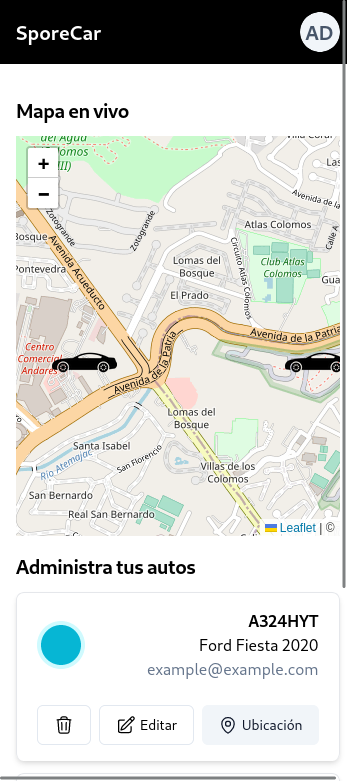
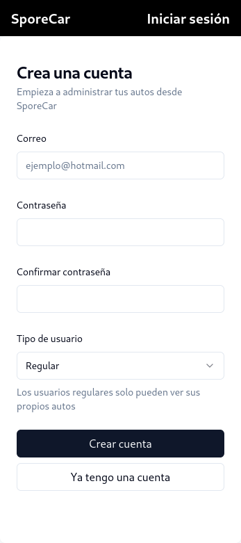

# SporeCar




SporeCar es una aplicación web que lleva el control de un grupo de usuarios y sus automóviles. En la aplicación, los usuarios pueden registrar, editar y eliminar automóviles, así como visualizar en tiempo real la ubicación (coordenadas geográficas) de sus autos en un mapa interactivo.

## Iniciar la aplicación

La aplicación está dividida en dos repositorios distintos, uno para el cliente y otro para el servidor. A continuación se presentan las instrucciones para iniciar el cliente. Para conocer las instrucciones del servidor, visita el [repositorio del servidor](https://github.com/adairo/spore-server)

### Requisitos

Se deben contar con los siguientes herramientas/programados instalados para iniciar el servidor.

- Node.js - [Instalar Node](https://nodejs.org/en)
- Git (https://git-scm.com/downloads)
- Conocimientos básicos de la línea de comandos

### Instalación de repositorio

Se debe contar con una versión de este repositorio de forma local. Para ello vamos a abrir una terminal y vamos a crear una carpeta para alojar el proyecto.

`$ mkdir spore-car && cd spore-car`

clonamos el repositorio y nos posicionamos dentro de la carpeta del servidor

`$ git clone https://github.com/adairo/spore-client && cd spore-server`

### Instalación de dependencias

Una vez en el directorio del proyecto, vamos a instalar las dependencias del proyecto con el siguiente comando:

`$ npm install`

### Iniciar el servidor

Por último, se lanza la aplicación en modo desarrollo con el siguiente comando:

`$ npm run dev`

Se debe mostrar en la consola un mensaje que dice:

```
VITE v4.3.9  ready in 2106 ms

  ➜  Local:   http://localhost:5173/
  ➜  Network: use --host to expose
  ➜  press h to show help

```

Para ejecutar la aplicación se debe ingresar desde el navegador a la dirección expuesta por el anterior comando, en este caso http://localhost:5173/.


